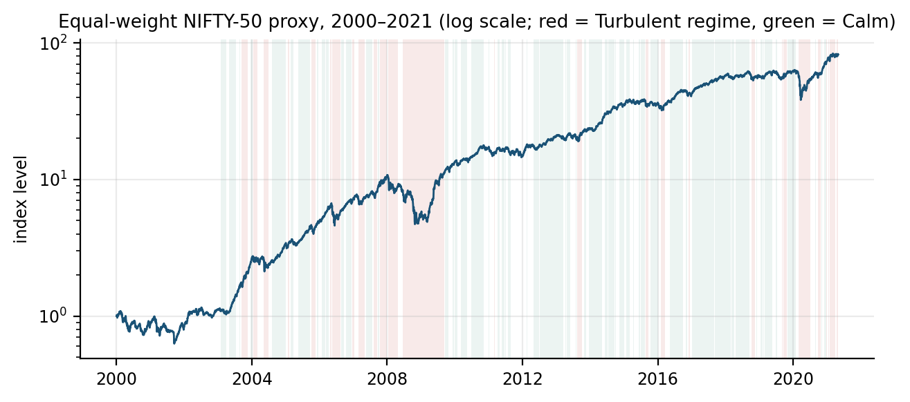
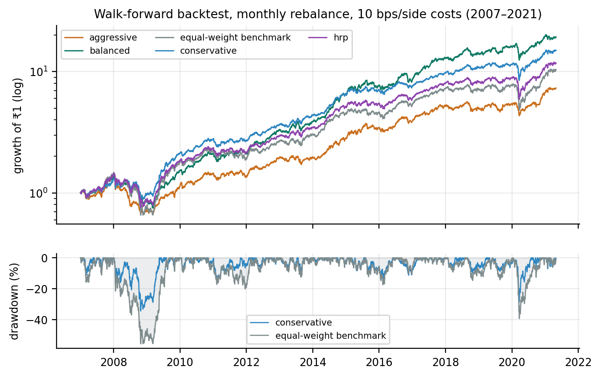

# NIFTY-50 Investment Intelligence

**An honest, fully reproducible investment decision-support platform built from 21 years of NIFTY-50 market data — and nothing else.**

*Team **The_Bull_Monster** — Aditya Raj · Nitin | Cult Open Projects 2026*


-orange)

Built for **Cult Open Projects 2026 — "Data-Driven Investment Intelligence Using NIFTY-50 Market Data"**. Every number in the dashboard and the [12-page technical report](reports/technical_report.pdf) is produced by one command from the raw CSVs. Nothing is hand-typed; honesty is enforced by construction.



## What it does

| Module | What you get |
|---|---|
| **Stock Predictor Engine** (mandatory A) | Pooled LightGBM return + direction forecasts at 1/5/21 days, evaluated strictly out-of-sample against naive/drift/ridge/always-up baselines with MAE, RMSE, R², directional accuracy, Brier, ECE — plus volatility-scaled **conformal 90% intervals** that held through the COVID crash |
| **Portfolio Construction** (mandatory B) | Conservative (min-variance), Balanced (max-Sharpe, shrunk inputs), Aggressive (momentum + model tilt) — Ledoit-Wolf covariance, per-name & sector caps, causal regime de-risking overlay, 14-year monthly-rebalanced backtest net of costs, efficient frontier, HRP comparison |
| **Risk Assessment** (mandatory C) | Vol, Sharpe, Sortino, max drawdown, Calmar, VaR/CVaR 95/99, beta, rolling versions, risk-contribution decomposition, **Kupiec-validated** VaR backtests |
| **Explainable AI** (optional) | Exact TreeSHAP attributions (LightGBM `pred_contrib`), plain-English reason codes per forecast, per-weight portfolio rationale |
| **Anomaly Detection** (optional) | Robust z-score detectors with reason strings; re-discovers the 2004/2008/2009/2013/2016/2020 crises from the data alone |
| **Forecasting Module** (optional) | EWMA(0.94) production volatility layer + GARCH(1,1)-t evidence comparison (QLIKE, Mincer-Zarnowitz) |
| **Deployment** (optional) | 7-page interactive Streamlit dashboard reading precomputed artifacts only |

## The data trap this repo defuses

The published dataset is **not adjusted for corporate actions**: 92 days carry artificial "returns" of −50% to −95% (ITC −92.7% on 2005-09-21 was a bonus+split, not a crash). Any model or risk metric built naively on it is corrupted. Since external data is forbidden by the competition rules, the pipeline **detects 94 events from price ratios alone** (ratio-snapping to plausible split/bonus fractions + an open-price anchor + 4-condition test for small bonuses) and back-adjusts prices and volumes — while deliberately leaving the three *genuine* >+30% crisis rallies untouched. A hard gate fails the build if any artificial cliff survives.

## Quickstart (dashboard in ~2 minutes)

```bash
git clone https://github.com/TheDeveloperAAA/nifty-intelligence.git
cd nifty-intelligence
python3.11 -m venv .venv && source .venv/bin/activate
pip install -r requirements.txt
streamlit run app/Home.py        # works immediately — artifacts are committed
```

> macOS + Apple Silicon note: if `import lightgbm` ever complains about OpenMP, `brew install libomp`. (Only needed for retraining, not for the dashboard.)

## Full reproduction

```bash
make all      # raw CSVs → every artifact, figure and the 12-page PDF (~20–35 min on an 8GB M1)
make test     # 50+ unit & property tests (split detection, leakage invariance, folds, metrics, optimizer)
make smoke    # 6-symbol end-to-end pipeline in <30 s (what CI runs)
python scripts/verify_repro.py   # compare your run's result hashes against the committed manifest
```

Determinism: seed 42 with derived per-stage seeds, LightGBM `deterministic=true` + pinned `num_threads=4`, `PYTHONHASHSEED=0`. Stage outputs are cached by content hash; rerunning is incremental. The longest stage is walk-forward training (~2–3 min); everything else is seconds.

## Headline results (all out-of-sample, regenerated by `make all`)

**Forecasting** (relMAE < 1 beats the zero-return baseline; full tables in the [report](reports/technical_report.pdf)):

| Horizon | Window | relMAE vs naive | Dir. accuracy | Always-up | Brier | 90%-band coverage |
|---|---|---|---|---|---|---|
| 1d | CV pooled | 0.9997 | 51.5% | 50.3% | 0.2502 | 90.1% |
| 5d | CV pooled | 0.9996 | 52.1% | 52.6% | 0.2513 | 90.3% |
| 21d | CV pooled | 0.9949 | 53.1% | 55.3% | 0.2637 | 90.8% |
| 21d | **Locked TEST** (COVID) | **0.9856** | 59.5% | 59.5% | 0.2448 | 84.8% |

Short-horizon return margins are honestly thin — consistent with market efficiency. The platform's dependable intelligence is **calibrated probabilities** (ECE ≈ 1%), **uncertainty bands** that survived March 2020, **volatility forecasts** (MZ-R² up to 0.15), and the portfolio layer:

**Portfolios** (walk-forward 2007–2021, monthly rebalance, 10 bps/side costs):

| Strategy | CAGR | Vol | Sharpe | MaxDD | Calmar | Turnover/yr |
|---|---|---|---|---|---|---|
| Conservative (min-vol) | 21.2% | 15.5% | **0.98** | **−34.4%** | 0.62 | 1.8× |
| Balanced (max-Sharpe) | **23.4%** | 16.6% | **1.05** | −46.2% | 0.51 | 3.1× |
| Aggressive (momentum+model) | 15.2% | 16.6% | 0.55 | −51.4% | 0.30 | 4.1× |
| HRP comparison | 19.1% | 17.5% | 0.75 | −47.5% | 0.40 | 2.1× |
| Equal-weight benchmark | 18.1% | 20.7% | 0.58 | −55.5% | 0.33 | 0.8× |



## Repository map

```
config/config.yaml        every constant the pipeline uses (single source of truth)
data/raw/                 49 per-stock CSVs + metadata (CC0, checksummed, committed)
src/cli.py                python -m src.cli run all|<stage> [--force]   ← what `make` calls
src/core/                 pure, unit-tested logic: adjustments, indicators, labeling,
                          walkforward, conformal, vol_models, optimizer, backtest,
                          risk_metrics, anomalies, regimes, explain_text
src/stages/s01..s09       orchestration shells: data → features → models → volatility →
                          portfolio → risk → anomaly → explain → report
src/report/               matplotlib figures + fpdf2 12-page composer (page count asserted)
app/                      Streamlit dashboard — imports only pandas/numpy/plotly/streamlit;
                          never imports ML libraries (test-enforced); reads artifacts only
artifacts/                committed pipeline outputs the app & report consume
reports/                  technical_report.pdf + figures
tests/                    52 unit/property/render tests
```

## Methodology in one paragraph

Stitch 16 historical ticker renames (65 symbols → 49 companies) → repair corporate actions → build equal-weight market/sector proxies and causal volatility regimes (expanding terciles) → engineer **42 leakage-free features** (returns, trend, oscillators, volatility, volume/liquidity, cross-sectional ranks, market/sector context, calendar; leakage disproven by prefix- and future-shuffle-invariance property tests plus a shuffled-target run) → train pooled LightGBM per horizon under **expanding walk-forward CV** (6 folds 2008–2019 + locked 2020–21 test, purge = horizon + 5-day embargo; hyperparameters swept once on F1–F3 then frozen) → calibrate forecasts (Mincer-Zarnowitz) and probabilities (isotonic) **only on pooled prior-fold OOS predictions** → wrap in volatility-scaled split-conformal intervals → feed EWMA vol, Ledoit-Wolf portfolios with caps and a regime brake → measure everything with a Kupiec-validated risk suite → explain with exact TreeSHAP reason codes.

## Configuration

Everything lives in [config/config.yaml](config/config.yaml): horizons, windows, fold boundaries, LightGBM parameters, conformal α, profile caps, costs, rf assumption, anomaly thresholds, seeds. `config/config_smoke.yaml` is the 6-symbol CI variant.

## Data

Source: [NIFTY-50 Stock Market Data (Kaggle, CC0)](https://www.kaggle.com/datasets/rohanrao/nifty50-stock-market-data) — the dataset designated by the problem statement, spanning 2000-01-03 → 2021-04-30. Committed under `data/raw/` with SHA-256 checksums so judges need no Kaggle account; `python scripts/get_data.py` re-downloads and verifies provenance. `NIFTY50_all.csv` is intentionally omitted (verified redundant concatenation); `INFRATEL.csv` is empty upstream → 49 usable companies. Details: [data/README.md](data/README.md).

## Limitations (stated, not buried)

- **Survivorship bias**: the universe is the April-2021 index membership — absolute return levels are inflated; all skill claims are vs in-universe baselines, which cancels the bias for comparisons.
- **Price returns only**: dividends are absent from the dataset; Sharpe ratios are modestly understated, uniformly.
- **Equal-weight proxy** stands in for the cap-weighted NIFTY (market caps are not in the data).
- **Dataset ends 2021-04-30** — this is a historical decision-support study.

## Disclaimer

Educational project for Cult Open Projects 2026. Nothing in this repository is investment advice.

## License

MIT for the code (see [LICENSE](LICENSE)); the dataset is CC0 from its publisher.
